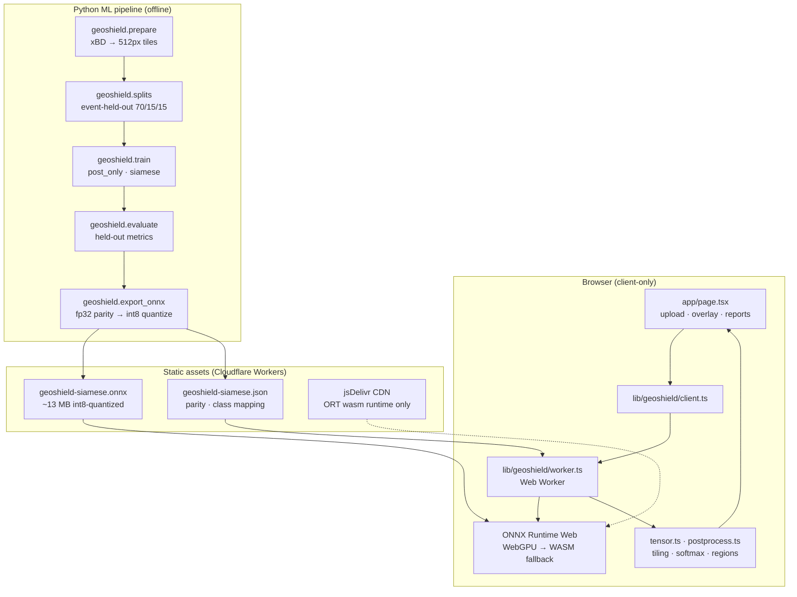

# GeoShield AI

Browser-only **before/after satellite imagery → building damage** assessment.
Upload a pre- and post-disaster image pair; inference runs entirely in your
browser via ONNX Runtime Web (WebGPU, falling back to WASM). **No image bytes
leave the device** — there is no upload endpoint.

> **Research prototype.** The bundled ONNX model (`public/models/geoshield-siamese.onnx`)
> is currently an **untrained placeholder** exported from a synthetic eight-tile
> smoke fixture (`trained_on_real_data: false` in the metadata JSON). The UI
> discloses this. Replace it with a real xBD-trained export before treating
> results as meaningful. See [`findings.md`](findings.md) for the full
> engineering audit trail.

---

## Architecture



| Layer | Stack |
|-------|-------|
| Frontend | Vinext/Sites, React 19, Tailwind 4, shadcn |
| Inference | `onnxruntime-web` 1.29, dedicated Web Worker |
| Hosting | Cloudflare Workers Static Assets (25 MiB/file cap) |
| Training | PyTorch 2.x, ResNet-18 U-Net variants, xBD |

**Models**

- **`PostOnlyUNet`** — baseline; post-disaster image only, five-class segmentation.
- **`SiameseUNet`** — shared ResNet-18 encoder on a concatenated before+after batch
  (single forward pass — required for stable BatchNorm at small batch sizes), multi-scale
  feature fusion via `[before, after, |after − before|]`, then U-Net decoder.

**Damage classes** (xBD-aligned): background (0), undamaged (1), minor (2), major (3), destroyed (4).

---

## Local development

**Requirements:** Node ≥ 22.13.0, Python ≥ 3.11.

```bash
# Frontend
npm install
npm run lint
npx tsc --noEmit
npm test                    # vitest (lib/geoshield unit tests)

# Python ML package (repo-root venv — never system Python)
python3 -m venv .venv
.venv/bin/pip install -e "ml/[dev]"
PYTHONPATH=ml .venv/bin/python -m pytest ml/tests -q
```

**Running the app**

```bash
npm run build && npm start   # wrangler dev on production build → http://localhost:8787
```

> **Do not use `npm run dev` to test the Web Worker / ONNX path.** Vinext's
> `import.meta.url` rewriter breaks Vite's module-worker pattern in dev mode
> only ([F-07](findings.md)). Use the production build for anything touching
> `lib/geoshield/worker.ts`.

---

## Dataset: manual download (required once)

GeoShield trains on the official **[xView2 / xBD](https://xview2.org/dataset)**
Challenge **training** split (~7.8 GB). Registration is free but **must be done
manually** — this repo does not automate sign-in, and **never commits dataset
content** (`data/` is gitignored).

### 1. Register and download

1. Go to **[xview2.org/dataset](https://xview2.org/dataset)** and create an account.
2. Download the **Challenge training** tarballs (all training-tier archives; test/hold
   splits are not needed for this project). Typical files include
   `train_images_labels_targets.tar.gz` and tier-3 archives — get everything labeled
   for the training split.
3. Verify checksums against the hashes published on xview2.org when provided.

### 2. Extract (do not reorganize)

Extract all archives into one directory. The official layout already provides
`images/` and `labels/` per tier:

```text
data/xbd/raw/
  train/
    images/     # *_pre_disaster.png, *_post_disaster.png
    labels/     # *_pre_disaster.json, *_post_disaster.json
  tier3/        # (if present in your download)
    images/
    labels/
```

### 3. Prepare tiles

Rasterizes JSON polygons to masks, tiles to 512×512, writes `records.json` and
`audit.json`:

```bash
PYTHONPATH=ml .venv/bin/python -m geoshield.prepare \
  --input data/xbd/raw/train \
  --output data/prepared \
  --tile-size 512
```

Inspect `data/prepared/audit.json` — expect zero `missing_pairs` / `invalid_records`
and a plausible class distribution in `class_pixels`. A visual audit grid is written
under `artifacts/visual_audits/` when configured.

### 4. Event-held-out split

Disaster **events** are assigned to train / val / test (70 / 15 / 15) so the same
disaster never leaks across splits. With xBD's ~10 events and heavy size skew,
record counts per split will **not** be exactly 70/15/15 — that is expected.

```bash
PYTHONPATH=ml .venv/bin/python -m geoshield.splits \
  --records data/prepared/records.json \
  --output data/prepared/split_manifest.json
```

---

## Training

Default real-data config (`ml/geoshield/config.py`): 512 px tiles, batch 4, 30 epochs,
AdamW lr `1e-4`, cosine schedule, early stopping patience 7 on validation
`damage_macro_f1`.

```bash
# Baseline
PYTHONPATH=ml .venv/bin/python -m geoshield.train \
  --model post_only \
  --data data/prepared \
  --split-manifest data/prepared/split_manifest.json \
  --output ml/checkpoints

# Siamese (primary model for browser export)
PYTHONPATH=ml .venv/bin/python -m geoshield.train \
  --model siamese \
  --data data/prepared \
  --split-manifest data/prepared/split_manifest.json \
  --output ml/checkpoints
```

Checkpoints: `{model}_best.pt`, `{model}_last.pt`. Training curves are appended to
`{model}_history.json` **every epoch** (safe to tail during long runs).

**Resume after interruption** (Colab disconnect, laptop sleep, etc.):

```bash
PYTHONPATH=ml .venv/bin/python -m geoshield.train \
  --model siamese \
  --data data/prepared \
  --split-manifest data/prepared/split_manifest.json \
  --output ml/checkpoints \
  --resume ml/checkpoints/siamese_last.pt
```

**Smoke gate** (CI / pipeline verification only — not real detection quality):

```bash
PYTHONPATH=ml .venv/bin/python -m geoshield.train --model siamese --smoke-test
```

### Colab / Kaggle (GPU)

Real training on a laptop CPU is slow; a free GPU runtime is recommended.

1. **Prepare data locally** (steps above), then upload `data/prepared/` to Drive or
   mount as a Kaggle dataset — uploading raw 7.8 GB tarballs and running `prepare`
   on-platform also works but is slower.
2. Clone this repo and install the ML package:

   ```python
   !git clone <your-repo-url> geoshield && cd geoshield
   !python3 -m venv .venv
   !.venv/bin/pip install -e "ml/[dev]"
   ```

3. Point `--data` at your prepared directory (e.g. `/content/drive/MyDrive/geoshield/prepared`).
4. Run both `train` commands above. Use `--resume ml/checkpoints/siamese_last.pt` after
   disconnects.
5. Download `ml/checkpoints/siamese_best.pt` (and `post_only_best.pt` for comparison)
   back to your dev machine for evaluation and ONNX export.

---

## Evaluation protocol

Evaluation reuses the same confusion-matrix metrics as the training loop, run once
over a held-out split. Model architecture and image size are read from the checkpoint
config — you cannot accidentally evaluate a siamese checkpoint as post-only.

**Primary acceptance criterion:** Siamese **`damage_macro_f1`** on the **test** split
should exceed the post-only baseline (macro-F1 over damage classes 1–4, ignoring
background).

```bash
PYTHONPATH=ml .venv/bin/python -m geoshield.evaluate \
  --checkpoint ml/checkpoints/siamese_best.pt \
  --data data/prepared \
  --split-manifest data/prepared/split_manifest.json \
  --split test \
  --output artifacts/metrics/siamese_eval.json

PYTHONPATH=ml .venv/bin/python -m geoshield.evaluate \
  --checkpoint ml/checkpoints/post_only_best.pt \
  --data data/prepared \
  --split-manifest data/prepared/split_manifest.json \
  --split test \
  --output artifacts/metrics/post_only_eval.json
```

**Reported metrics** (`ml/geoshield/metrics.py`):

| Metric | Meaning |
|--------|---------|
| `damage_macro_f1` | Macro-F1 over classes 1–4 (primary model-selection metric) |
| `localization_f1` | Building vs background detection quality |
| `per_class_f1` / `per_class_iou` | Per-class breakdown |
| `confusion_matrix` | Full 5×5 matrix |

Compare `damage_macro_f1` in the two JSON files. All artifacts under `artifacts/` are
gitignored.

---

## ONNX export (replace the placeholder)

Export verifies **fp32 PyTorch ↔ ONNX parity** (≥ 99.9% argmax agreement on random
inputs), then **int8-dynamic-quantizes** Conv/MatMul/Gemm ops so the shipped file stays
under Cloudflare's **25 MiB** static-asset limit (~53 MB fp32 → ~13 MB quantized).

```bash
PYTHONPATH=ml .venv/bin/python -m geoshield.export_onnx \
  --model siamese \
  --checkpoint ml/checkpoints/siamese_best.pt \
  --output public/models/geoshield-siamese.onnx
```

This writes `public/models/geoshield-siamese.json` alongside the ONNX file (SHA-256,
quantization agreement, `trained_on_real_data`, class mapping). Rebuild the frontend
after replacing the model:

```bash
npm run build
```

The UI reads `trained_on_real_data` from metadata and updates its disclosure banner.

---

## Privacy

- **Imagery and inference outputs never leave the browser.** There is no backend
  inference API and no telemetry on uploaded files.
- The only third-party network fetch at runtime is the **ONNX Runtime Web wasm binary**
  from a **version-pinned jsDelivr CDN URL** (`worker.ts`) — generic ML runtime code,
  not user data or model weights (weights ship as same-origin static assets).
- Exported JSON/CSV reports are generated and downloaded locally in-browser.

---

## Model limitations

- **Placeholder status:** Until a real xBD-trained export replaces the current ONNX file,
  segmentation output is **not meaningful** for operational damage assessment.
- **Resolution:** Inference resizes inputs to 1024×1024 working space, runs 512×512
  tiled inference, then stitches — very large images may lose fine detail.
- **Domain:** Trained (when complete) on xBD disaster events (mostly US wildfires,
  hurricanes, earthquakes). Generalization to other sensors, geographies, or disaster
  types is unvalidated.
- **Quantization:** int8 dynamic quantization introduces minor prediction drift
  (~99.9% pixel agreement with fp32 in smoke exports — see metadata JSON).
- **Post-processing heuristics:** Connected-component grouping and minimum region size
  filters are simple; they are not a substitute for GIS-grade building footprints.
- **No human-in-the-loop review, no confidence calibration, no official endorsement.**

---

## Deployment

Target: **Cloudflare Workers** via Vinext's Cloudflare plugin.

```bash
npm run build    # → dist/
npm start        # local wrangler dev against dist/
```

**Constraints already handled in code:**

| Constraint | Mitigation |
|------------|------------|
| 25 MiB per static asset | int8-quantized ONNX (~13 MB); ORT wasm loaded from CDN |
| Module Worker in dev | Use production build for Worker testing ([F-07](findings.md)) |

Public deployment (Step 16) requires explicit approval per project operating rules.
Do not deploy without confirming hosting credentials and replacing the placeholder model.

---

## Verification checklist

```bash
# Full automated sweep (Step 15)
npm test
npm run test:e2e      # Playwright, when configured
npm run lint
npm run build
PYTHONPATH=ml .venv/bin/python -m pytest ml/tests -q
```

**Manual checks**

- [ ] Mobile layout readable; upload cards and overlay usable on narrow viewports
- [ ] Keyboard navigation: file inputs, run/cancel, export buttons reachable
- [ ] Before/after upload → inference completes (WebGPU badge or WASM fallback)
- [ ] Cancel mid-run recovers cleanly; second run without page reload
- [ ] JSON and CSV exports download with sensible filenames
- [ ] Placeholder / `trained_on_real_data` disclosure visible when applicable
- [ ] xBD sample guidance links to [xview2.org/dataset](https://xview2.org/dataset)

---

## Project layout

```text
app/page.tsx              # Single-page UI
lib/geoshield/            # Browser inference (client, worker, tensor, postprocess, reports)
ml/geoshield/             # Python pipeline (prepare, splits, train, evaluate, export_onnx)
public/models/            # Shipped ONNX + metadata (only committed model artifacts)
data/                     # gitignored — raw xBD + prepared tiles
ml/checkpoints/           # gitignored — training checkpoints
artifacts/                # gitignored — metrics, visual audits
findings.md               # Engineering audit log (bugs, fixes, open questions)
AGENTS.md                 # Agent operating notes (short form of findings.md)
```

---

## Technical writeup (interview-ready)

**Problem.** Disaster responders need rapid building-damage maps from satellite
before/after pairs. Cloud inference raises privacy and latency concerns for
sensitive imagery.

**Approach.** Train a lightweight siamese segmentation model on xBD offline; export
to ONNX with verified parity and aggressive quantization; run inference entirely in
a Web Worker using ONNX Runtime Web, preferring WebGPU.

**Key engineering decisions**

1. **Event-held-out splits** — prevents the model from memorizing a specific disaster's
   geography rather than learning damage patterns.
2. **Single-batch siamese encoder** — concatenating before/after into one forward pass
   fixed a critical BatchNorm instability (train F1 0.98 vs eval F1 0.10 before fix).
3. **Client-only inference** — no server upload; suitable for air-gapped or
   privacy-sensitive workflows once a real model is shipped.
4. **Quantized ONNX under 25 MiB** — fp32 export passed parity but failed Cloudflare's
   static asset limit; Conv-targeted int8 quantization was the deployment gate.
5. **CDN-hosted ORT runtime** — the WebGPU-capable wasm binary alone exceeds 25 MiB;
   loading it from jsDelivr keeps the deployed bundle compliant without dropping WebGPU.

**Honest scope.** This is a research prototype demonstrating an end-to-end pipeline
(scaffold → train → export → browser inference → reports), not a validated operational
detector. Real xBD training and the Siamese-vs-baseline acceptance test remain the
user's responsibility after manual dataset download.

**What I'd do next.** Real training run + held-out evaluation; swap placeholder ONNX;
WASM vs WebGPU output diff test; optional WebNN provider; footprint-aware post-processing;
calibrated confidence thresholds per disaster type.

---

## References

- [xView2 / xBD dataset](https://xview2.org/dataset) — Gupta et al., CVPR 2019 xBD challenge
- [ONNX Runtime Web](https://onnxruntime.ai/docs/tutorials/web/)
- [Cloudflare Workers static asset limits](https://developers.cloudflare.com/workers/platform/limits/#static-assets)
- [`findings.md`](findings.md) — full bug/fix log for this repo
